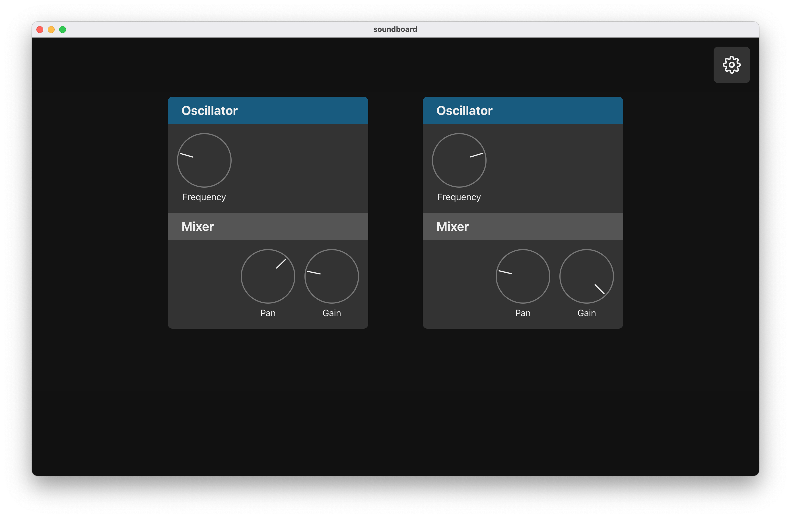

# soundboard
soundboard is a live-performance music playground inviting everybody to get creative and to experiment with sounds.
It is designed to be straightforward to use and to be understandable without knowing all the [muso slang](https://youtu.be/DRwpCT_QVsA?t=198).
Behind the scenes, it is a React-based [Electron](https://github.com/electron/electron) app backed by a C++ native module built around the [JUCE](https://github.com/juce-framework/JUCE) framework.
It started out as a personal project to learn audio programming, but everyone is invited to contribute :).



## Contents
- [Build Instructions](#build-instructions)
- [Architecture](#architecture)
- [Features](#features)
- [Roadmap](#roadmap)
- [Third-Party Credits](#third-party-credits)
- [License](#license)

## Build Instructions
soundboard is known to work under macOS Big Sur on Intel and M1 macs. If someone wants to get their hands dirty and add Linux or Windows support, that'll make a great first contribution :).

0. Prerequisites
    - Install [Node.js](https://nodejs.org/)
    - Setup [SSH key authentication](https://docs.github.com/github/authenticating-to-github/connecting-to-github-with-ssh/adding-a-new-ssh-key-to-your-github-account) for your GitHub account (technically not required, but you have to adjust the submodule urls otherwise)
1. Clone the repo
    ```sh
    git clone --recurse-submodules git@github.com:deermichel/soundboard.git
    ```
2. Install npm dependencies
    ```sh
    cd soundboard
    npm install
    ```
3. Build and start the app
    ```sh
    npm start

    # or compile on multiple threads to speed up the build
    JOBS=max npm start
    ```
4. _Optional:_ After changing native code, you have to remove the built addon to force a rebuild
    ```sh
    rm -rf build && npm start
    ```

## Architecture
TODO: write some history starting from Pedalboard and the four attempts before this one.

## Features
- One super-boring instrument: Sine-wave oscillator - BUT with MIDI support
- Channel mixer with panning and gain controls
- [Here's some music](https://open.spotify.com/album/5u25ZtMjzYBljoh5CDexm9?si=6PVwCStFRuKdPE-YkwHzpA) while you wait for new features...

## Roadmap
### 1.0.0 (release date: unknown)
- [ ] [backend&frontend] audio input mono & stereo
- [ ] [backend&frontend] configure audio & midi inputs, outputs
- [ ] [backend&frontend] piano sampler unit
- [ ] [backend&frontend] session handling
- [ ] [backend&frontend] volume meter
- [ ] [backend] fix compile warnings
- [ ] [backend] review TODOs
- [ ] [backend] complete code review (const correctness, method ordering, dead imports, private vs public)
- [ ] [backend] setup and add unit tests
- [ ] [frontend] complete code review
- [ ] [frontend] fix missing or wrong key props
- [ ] [frontend] i18n: en, muso slang
- [ ] [frontend] review eslint ignores
- [ ] [frontend] setup and add unit tests
- [ ] [org] design a logo (idea: spotlight, knob, fader)
- [ ] [org] package app
- [ ] [org] write architecture section in readme

### Ideas
- [backend&frontend] quick transpose
- [frontend] first steps builtin tutorial
- [frontend] i18n: church slang
- [org] setup CI/CD pipeline with GitHub Actions
- [org] publish in app store
- [org] use GitHub projects for this roadmap
- [org] write contribution guide

## Third-Party Credits
- [Electron](https://github.com/electron/electron) ([MIT](https://github.com/electron/electron/blob/ccfde6c9d44e64621e2c3a92e5113c1d26e61d67/LICENSE)): They invest an incredible effort to make cross-platform desktop development a breeze.
- [Feather Icons](https://github.com/feathericons/feather) ([MIT](https://github.com/feathericons/feather/blob/a718a7e9c39447202f703783336e8ba1c8e32405/LICENSE)): Big shout-out to my former co-intern [@colebemis](https://github.com/colebemis) for providing these gorgeous icons.
- [JUCE](https://github.com/juce-framework/JUCE) ([GPL v3](https://github.com/juce-framework/JUCE/blob/90e8da0cfb54ac593cdbed74c3d0c9b09bad3a9f/LICENSE.md)): I consider JUCE as being the washing machine of audio programmers.
- And thanks to all the unmentioned thousands of contributers behind the amazing projects that keep this app running.

## License
This project is released under the GNU GPL v3 License. (See [LICENSE](LICENSE) for more information.)
```
soundboard - live-performance music playground
Copyright (c) 2021 Micha Hanselmann

This program is free software: you can redistribute it and/or modify
it under the terms of the GNU General Public License as published by
the Free Software Foundation, either version 3 of the License, or
(at your option) any later version.

This program is distributed in the hope that it will be useful,
but WITHOUT ANY WARRANTY; without even the implied warranty of
MERCHANTABILITY or FITNESS FOR A PARTICULAR PURPOSE.  See the
GNU General Public License for more details.

You should have received a copy of the GNU General Public License
along with this program.  If not, see <https://www.gnu.org/licenses/>.
```
